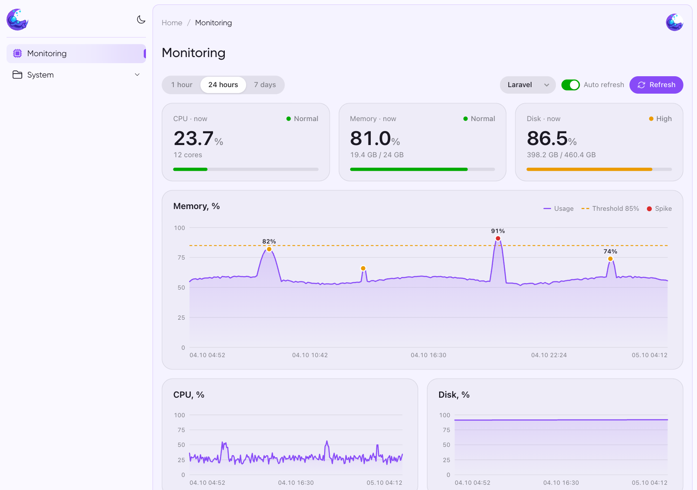
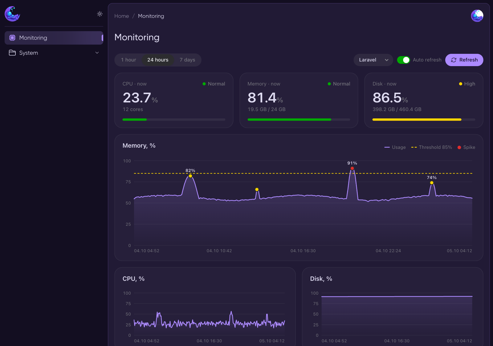
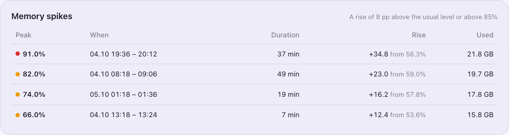
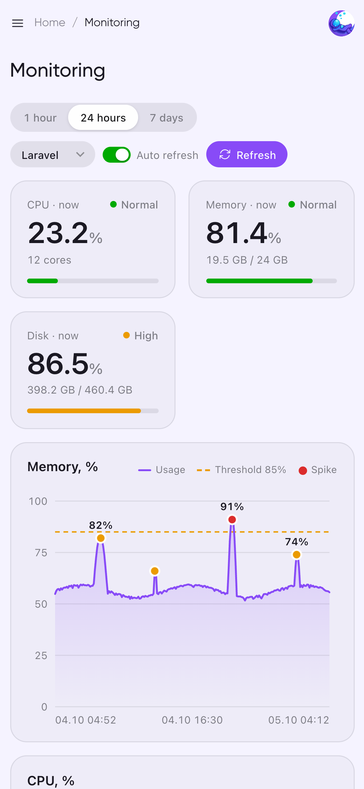
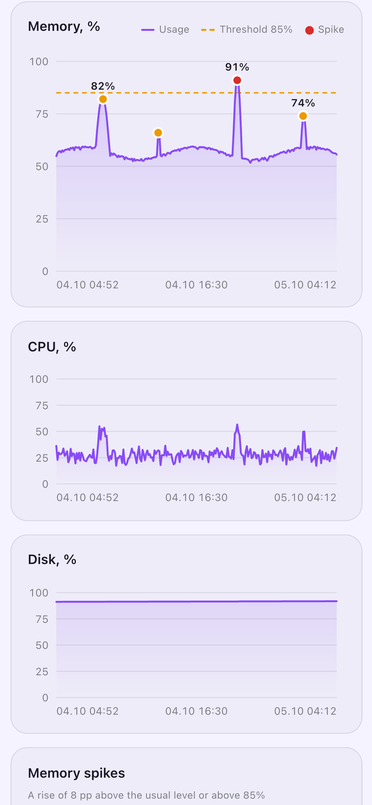
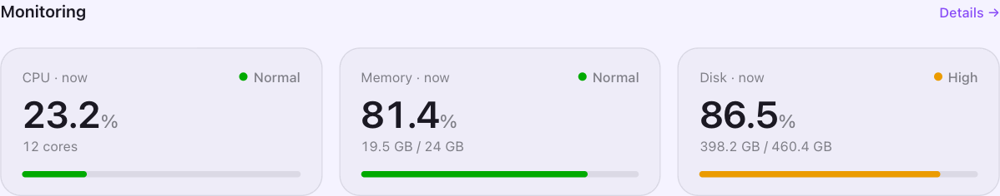

# Moonshine Monitoring

[](https://github.com/zhandos717/moonshine-monitoring/actions/workflows/tests.yml)
[](https://packagist.org/packages/zhandos717/moonshine-monitoring)
[](https://moonshine-laravel.com)

Server monitoring package for the [MoonShine](https://moonshine-laravel.com) admin panel: CPU, memory and disk usage with history, right inside your admin.

| Light | Dark |
|---|---|
|  |  |

**Memory spikes**



**Mobile**

<p>
  
  
</p>

## Requirements

| | Version |
|---|---|
| PHP | 8.2+ |
| Laravel | 10, 11, 12, 13 |
| MoonShine | 3.x, 4.x |

## Description

Moonshine Monitoring is a Laravel package that provides system resource monitoring capabilities for applications using the MoonShine admin panel. It tracks CPU, memory, and disk usage of your server and displays this information in an intuitive dashboard within MoonShine.

## Features

- Real-time monitoring of CPU usage
- Memory consumption tracking
- Disk space monitoring
- Data visualization in MoonShine dashboard
- Command-line interface for manual data recording
- Database storage of monitoring records
- Automatic data purging based on configuration
- Multi-instance support with instance naming
- Pure PHP implementation (no shell scripts required)
- Supports MoonShine 3.x and 4.x
- Memory spike detection: spikes are marked on the chart and listed with peak, duration and rise over the usual level
- Time ranges: 1 hour, 24 hours, 7 days
- Several servers: switch between instances that write to the same database
- Auto refresh without page reload
- Alerts by email and Telegram when CPU, memory or disk stay above a threshold
- Dashboard widget for the MoonShine home page
- Old records are purged automatically
- Follows the MoonShine theme: light / dark mode and the theme's primary, success, warning and error colors
- Enhanced dashboard with progress bars and real-time updates
- Multi-language support (English and Russian)

## Installation

1. Install the package via composer:
   ```bash
   composer require zhandos717/moonshine-monitoring
   ```

2. Publish the configuration file:
   ```bash
   php artisan vendor:publish --tag=moonshine-monitoring-config
   ```

3. Run the migrations:
   ```bash
   php artisan migrate
   ```

4. The monitoring dashboard will automatically appear in your MoonShine menu.

## Usage

### Basic Usage

The package automatically adds a monitoring page to your MoonShine dashboard. You can configure whether this menu item is automatically added via the `auto_menu` option in the configuration file.

### Command Line

You can manually record resource usage via the command line:
```bash
php artisan moonshine-monitoring:record
```

### Scheduling

Schedule the record command to collect history. Laravel 11+ (`routes/console.php`):
```php
use Illuminate\Support\Facades\Schedule;

Schedule::command('moonshine-monitoring:record')->everyMinute();
```

Laravel 10 (`app/Console/Kernel.php`):
```php
protected function schedule(Schedule $schedule): void
{
    $schedule->command('moonshine-monitoring:record')->everyMinute();
}
```

## Configuration

After publishing the configuration file, you can modify the settings in `config/monitoring.php`:

- `auto_menu`: Whether to automatically add the monitoring page to the MoonShine menu
- `instance_name`: The name of this monitoring instance (defaults to your app name)
- `migrations`: Enable or disable package migrations
- `thresholds.warning` / `thresholds.critical`: status of the usage tiles, the threshold line on the memory chart (default 85 / 95)
- `memory_spikes.min_rise`: how many percentage points above the usual level counts as a spike (default 8)
- `memory_spikes.window`: number of recent calm samples the usual level is calculated from (default 15)
- `purge_before`: records older than this are deleted by `moonshine-monitoring:record` (default `-30 days`, `null` keeps everything)
- `disk_path`: partition shown as «Disk» (default `/`)
- `alerts`: notifications, see below
- `auto_refresh`: dashboard refresh interval in seconds, `0` disables it (default 60)

## Alerts

An alert is sent when a metric stays above its threshold for `alerts.minutes` minutes in a row (5 by default). The same metric is not reported again for `alerts.cooldown` minutes. Alerts are checked by `moonshine-monitoring:record`, so the command must be scheduled.

```dotenv
MONITORING_ALERTS=true
MONITORING_ALERT_MAIL=ops@example.com
MONITORING_TELEGRAM_BOT_TOKEN=123456:ABC...
MONITORING_TELEGRAM_CHAT_ID=-1001234567890
```

Email uses your Laravel mail settings. Telegram needs no extra packages.

## Dashboard widget



```php
use Zhandos717\MoonshineMonitoring\Components\MonitoringWidget;

// app/MoonShine/Pages/Dashboard.php
protected function components(): iterable
{
    return [
        MonitoringWidget::make(),
    ];
}
```

## Testing your application

Replace real measurements in your own tests:

```php
use Zhandos717\MoonshineMonitoring\Facades\Monitoring;

Monitoring::fake(cpu: 40, memory: 92, disk: 70);
```

## Dashboard Features

The updated monitoring dashboard includes:

1. **Real-time Resource Monitoring**
   - Visual progress bars for CPU, memory, and disk usage
   - Current usage percentage display
   - Auto-refresh functionality for real-time updates

2. **Historical Data Visualization**
   - Detailed table of historical monitoring records
   - Time-based sorting of records
   - Instance name identification

3. **User Interface Enhancements**
   - Multi-language support (English/Russian)
   - Responsive design for different screen sizes
   - Intuitive controls for data refresh

## Roadmap

### Short-term Goals (v1.x)

1. **Complete Dashboard Implementation**
   - Add line charts for historical data visualization
   - Implement filtering by time periods
   - Add instance comparison capabilities

2. **Notification System**
   - Implement Telegram notifications for resource threshold breaches
   - Add email notification support
   - Create configurable alert thresholds

3. **Performance Improvements**
   - Optimize database queries for large datasets
   - Implement data aggregation for long-term storage
   - Add caching mechanisms for frequently accessed data

4. **UI/UX Enhancements**
   - Improve the visual design of metrics display
   - Add dark mode support
   - Implement responsive design for mobile devices

### Long-term Goals (v2.x)

1. **Extended Monitoring Capabilities**
   - Network usage monitoring
   - Process monitoring
   - Service status monitoring
   - Database performance metrics

2. **Advanced Analytics**
   - Predictive resource usage analysis
   - Anomaly detection algorithms
   - Usage pattern recognition

3. **Multi-server Support**
   - Centralized monitoring dashboard
   - Cross-server comparisons
   - Distributed monitoring agents

4. **Export and Reporting**
   - PDF report generation
   - CSV data export
   - Scheduled report delivery

## Security

The page and the `monitoring/data` JSON endpoint are registered inside the MoonShine route group and protected by MoonShine authentication middleware.

## Testing

The package includes comprehensive tests for all components:

```bash
# Run all tests
composer test

# Run tests with coverage
composer test-coverage
```

### Test Coverage

- Unit tests for all models, actions, and system resources
- Feature tests for controllers and pages
- Configuration tests
- Tested against MoonShine 3.x and 4.x on PHP 8.2–8.4 in CI

### Running Tests

1. Install development dependencies:
```bash
composer install
```

2. Run the test suite:
```bash
./vendor/bin/phpunit
```

### Test Structure

The tests are organized as follows:
- `tests/Unit/` - Unit tests for individual components
- `tests/Feature/` - Feature tests for integrated functionality
- `tests/TestCase.php` - Base test case with package configuration

## Screenshots

README screenshots in `docs/` are taken by `docs/screenshots/shoot.mjs` (headless Chrome via puppeteer-core) from a running Laravel + MoonShine app with this package:

```bash
cd docs/screenshots && npm install
MS_URL=http://127.0.0.1:8000/admin MS_USER=admin@example.com MS_PASSWORD=secret npm run shoot
```

## Contributing

Contributions are welcome! Here's how you can help:

1. Fork the repository
2. Create a new branch for your feature or bug fix
3. Write your code and tests
4. Submit a pull request with a clear description of your changes

### Development Guidelines

- Follow PSR-12 coding standards
- Write meaningful commit messages
- Include tests for new functionality
- Update documentation when needed
- Ensure all tests pass before submitting a pull request

### Areas Needing Contribution

1. **Windows Support**
   - Replace deprecated `wmic` calls (removed in Windows 11 24H2)
   - Test cross-platform compatibility

2. **Additional Metrics**
   - Network usage monitoring
   - Process monitoring
   - Custom metric support

3. **Testing**
   - Expand test coverage
   - Add integration tests
   - Set up continuous integration

4. **Documentation**
   - Expand usage examples
   - Add troubleshooting guides
   - Create API documentation

## License

The MIT License (MIT). Please see [License File](LICENSE) for more information.